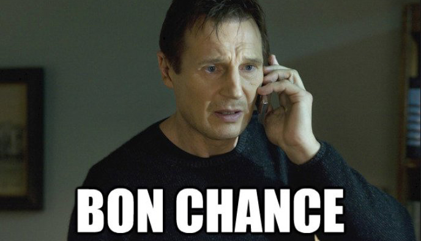

# MMI (DWeb) - Parlons JavaScript (pour le web, côté front)

L'objectif de ce TP noté est de tester vos connaissances en JavaScript (pour le web, côté front).

## ℹ️ Ressources externes

- Google ✅ autorisé
- StackOverflow ✅ autorisé
- ChatGPT ✅ autorisé
- Vous pouvez également aller fouiller dans le [Google Slide](https://docs.google.com/presentation/d/1goo873roIrB1XM2IBHHWHALEKFIlmQFBhHT5_3Sv7Mg/edit#slide=id.p) du cours
- [ToastifyJS](https://github.com/apvarun/toastify-js)

*Attention : si vous êtes deux élèves à avoir le même rendu, ça sera sanctionné : chacun a une manière différente d'écrire du code, il est donc assez facile de détecter ça.*

## ✍️ Enoncé 

J'ai préparé 'un squelette' de projet avec lequel vous pouvez démarrer, il se trouve dans le dossier [./contact-form](./contact-form). 

Le but est de construire un formulaire de contact en HTML / JavaScript *(voir maquette un peu plus bas)*.

#### contact-form/index.js

Ce formulaire de contact dispose de 4 champs et 1 bouton : 

1. Prénom *(obligatoire)*
2. Nom *(obligatoire)*
3. Email *(obligatoire)*
4. Message *(obligatoire)*
5. Bouton = "Envoyer le message"

#### contact-form/js/main.js

Lorsque l'utilisateur clique sur le bouton "Envoyer le message", plusieurs fonctions doivent être appelées avant de valider ce message :

1. **checkForm()** --> Cette fonction vérifie que tous les champs ont été remplis correctement *(tous les champs sont obligatoires)*
2. **checkEmail()** --> Cette fonction vérifie que l'adresse email est correctement formée *(xxxx@xxxxx.xx)*
3. **sendMessage()** --> Cette fonction ajoute le message dans la section "messages" (voir index.html), sous le titre "Liste des messages".
4. **cleanForm()** --> Cette fonction "nettoie" le fomulaire en supprimant les valeurs du formulaire.
5. **showToast()** --> Cette fonction est appelée si l'utilisateur a cliqué sur le bouton "Envoyer le message" mais que le formulaire n'est pas valide (champ manquant, email non valide). Alors il faudra afficher un message toast qui annonce le problème *(exemple : 'le champ email n'est pas valide')*

#### contact-form/css/style.css

Des points bonus sont ajoutés si vous faites quelque chose de "beau" avec du CSS et que vous personnalisez en ajoutant des couleurs, une background image, etc. Mais s'il vous plaît, faites quelque chose de fonctionnel avant de faire quelque chose de joli !

## ❌ Contrainte(s)

N'oubliez pas que si l'utilisateur **n'a pas complété tous les champs** ou si **son adresse email n'est pas valide**, le message ne doit pas s'ajouter à la liste.

Il faut alors afficher un message toast qui affiche brièvement à l'utilisateur la nature du problème.

Pour afficher le message toast, je vous propose d'importer une librairie externe.  
La librairie que je recommande est **ToastifyJS** [Doc](https://apvarun.github.io/toastify-js/#) | [Comment ajouter ToastifyJS en HTML](https://github.com/apvarun/toastify-js/blob/master/README.md#adding-toastifyjs-to-html-page-using-the-traditional-method).

## 🖼️ Maquette 

Ci-dessous, une maquette du travail attendu :

## 📩 Rendu 

Vous avez **01h00**, après le démarrage de l'épreuve.

Deux options pour rendre votre projet :  

#### Option n°1

  1. Zipper votre projet
  2. L'envoyer par email à **joey.bronner@unistra.fr**

#### Option n°2 (bonus +1 point)

  1. Créer un repo (privé) sur GitLab de l'Université : [https://git.unistra.fr/](https://git.unistra.fr/)
  2. Pusher votre projet sur ce repo
  3. M'ajouter en tant que contributeur ou reviewer (@joey.bronner)